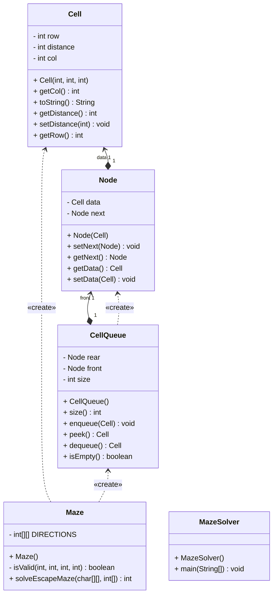

# Maze Solver

## CSC122 Introduction to Programming Lab Course - Object-Oriented Programming Assignment

This Java program demonstrates Object-Oriented Programming (OOP) concepts through the implementation of a maze solving application. The project applies OOP principles to solve the problem of finding the minimum number of moves needed to escape a maze, using Breadth-First Search (BFS) algorithm as the underlying solution method.

## Problem Description

You are placed in a maze represented by a grid, and you need to find the minimum number of moves to escape. The maze has the following characteristics:

- `P` represents your starting position
- `1` represents a path you can walk on
- `0` represents a wall (you cannot walk through)
- To escape the maze, you need to reach any cell at the border of the grid

## Algorithm

The program uses Breadth-First Search (BFS) to find the shortest path from the starting position to any border cell. BFS guarantees the shortest path in unweighted graphs and is ideal for this maze problem.

## How to Run

1. Compile all Java files:
   ```
   javac src/*.java -d bin
   ```

2. Run the program:
   ```
   java -cp bin MazeSolver
   ```

3. Input format:
   - First line: Two integers representing the number of rows and columns in the maze
   - Next rows: The maze layout with space-separated characters

4. Using test files:
   ```
   java -cp bin MazeSolver < tests/test1.txt
   ```

## Example Input

```
7 8
0 0 0 0 0 0 0 0
0 P 0 0 0 0 1 0
0 1 1 1 0 0 1 0
0 1 0 1 1 1 1 1
0 1 1 1 0 0 1 0
0 0 1 0 0 0 1 0
0 0 0 0 0 0 0 0
```

## Code Structure

The project follows an object-oriented design with five classes:

- `Cell`: Standalone class representing a position in the maze with its coordinates and distance
- `Node`: Class representing a node in the linked list for the queue implementation
- `CellQueue`: Custom queue implementation that uses Nodes to store Cell objects
- `Maze`: Class encapsulating the maze grid and providing methods to access and validate positions
- `MazeSolver`: Main class that uses the other components to solve the maze

The UML class diagram can be found in the [docs directory](docs/UML_Diagram.png).



## Notes

- The program validates that the maze size is at least 3x3
- It checks for the presence of a player position ('P')
- If no escape path exists, it will inform the user
- If there is more than one player, it will inform the user
- The program supports movement in four directions: up, right, down, and left

## Time and Space Complexity

- Time Complexity: O(rows × columns) - Each cell is processed at most once
- Space Complexity: O(rows × columns) - For the visited array and queue in worst case